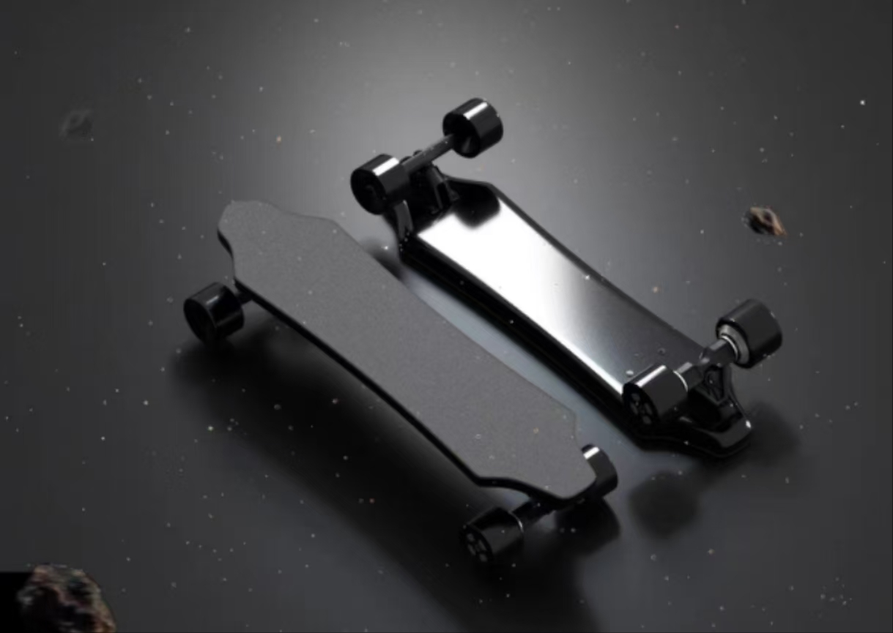

# 智能电动滑板设计
## 题目

电动滑板代表了个人交通工具的一个创新方向,结合了科技与运动的元素。它为短途出行提供了一个有趣且高效的选择,特别适合年轻人和科技爱好者。
这是一种结合了传统滑板和电动技术的现代交通工具。它看起来像普通滑板,但增加了电动马达、电池和控制系统。
滑板通过电动马达驱动轮子转动。骑手可以通过遥控器或身体重心移动来控制速度和方向。
本课题要求在研究大功率电机驱动的基础上，结合机械、传感、信息和控制等知识，利用仿真和开发工具，以单片机为核心，
选用霍尔电压、GPS，NFC等传感器，选择合适的轮毂电机和锂电池组，设计一个电动滑板，能适应不同路况，具有智能锁车，一碰骑， 一键找，轨迹记录等功能。
设计必须注意作品的实用性和性价比，同时考虑节能、环境、社会、法律等非技术因素。

## 设计要求：

设计单片机主控电路、压力传感器、倾角传感器、霍尔传感器、GPS和NFC等传感器电路、
电源管理电路、音频电路等，设计机械结构，同时设计传感器检测程序、FOC控制程序等软件，完成电动滑板车的软硬件设计、制作、调试和测试。
1. 至少包含压力传感器、倾角传感器、霍尔传感器、GPS和NFC等传感器；
2. 额定功率不低于300W，峰值功率不低于600W；；
3. 最大爬坡不低于10%坡度；
4. 续航不低于10km；
5. 载重不低于60kg；
6. 倾角传感器检测精度不低于0.1度；
7. 压力传感器检测精度不低于1N。
8. 支持按键控制和感应控制；
9. 支持手机一碰解锁，一键寻车，车辆足迹记录等功能。
