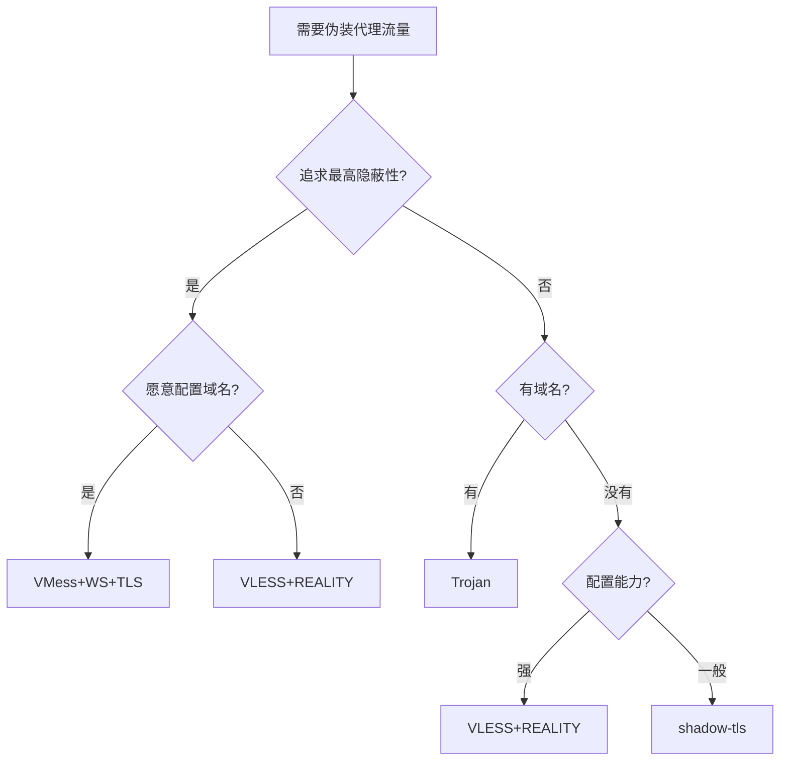

# IP检测与流量伪装技术详解

本文深入探讨IP信誉检测系统的工作原理，以及如何通过流量伪装技术避免被误判为可疑IP。涵盖主流代理协议的对比分析和最佳实践。

## IP信誉检测原理

### 为什么VPS会被标记为可疑IP？

当您使用VPS（虚拟专用服务器）时，特别是搭建了VPN或代理服务后，很容易被IP信誉检测系统标记为"可疑IP"。主要原因包括：

#### 数据中心IP的原罪
- **机房IP vs 住宅IP**: 数据中心的IP地址天然比家庭住宅IP更容易被怀疑
- **历史污染**: 同网段可能有其他用户搭建过代理服务，导致整个网段被提高警惕
- **流量模式异常**: 数据中心IP通常有大量、持续的流量，与普通用户行为不符

#### 流量特征识别
检测系统通过以下方式识别VPN/代理流量：

1. **协议指纹 (Protocol Fingerprint)**
   - OpenVPN、WireGuard等协议有独特的握手和数据包模式
   - DPI（深度包检测）能识别这些特征

2. **端口特征**
   - VPN使用固定端口（如OpenVPN的UDP/1194）
   - 非标准端口上的大量加密流量会引起怀疑

3. **流量行为模式**
   - 正常浏览：突发性、短连接、多目标
   - VPN流量：长连接、单一隧道、持续传输

### 主要检测机构对比

| 检测机构 | 检测重点 | 严格程度 | 影响范围 |
|---------|---------|---------|---------|
| **IPQualityScore (IPQS)** | 代理/VPN检测、欺诈预防 | 极高 | 商业网站反欺诈 |
| **Cloudflare** | DDoS防护、机器人检测 | 中等 | CDN保护的网站 |
| **AbuseIPDB** | 恶意行为历史记录 | 基于历史 | 安全社区共享 |
| **IP2Location** | 地理位置、ISP类型 | 低 | 地理定位服务 |

## 流量伪装技术架构

### 核心理念：让代理流量看起来像HTTPS

互联网上95%以上的流量都是HTTPS，将代理流量伪装成HTTPS是最完美的"保护色"。

### 伪装技术对比

## 代理协议技术架构深度解析

理解现代代理技术的关键在于掌握其三层架构模型。这个框架能帮助您准确理解各种协议的职责和相互关系。

### 核心三层架构模型

<div className="grid grid-cols-1 md:grid-cols-3 gap-6 my-8">
<div className="rounded-lg border-2 border-blue-500 bg-blue-50/50 dark:bg-blue-900/20 p-6">
<div className="flex items-center gap-3 mb-4">
<span className="text-3xl">🧠</span>
<h4 className="text-lg font-bold text-blue-700 dark:text-blue-300">第一层：代理协议</h4>
</div>
<p className="text-sm font-semibold mb-3">Proxy Protocol</p>
<p className="text-sm mb-3">定义了用户数据如何被加密、打包和认证。这是代理软件的"大脑和灵魂"。</p>
<div className="space-y-2 text-sm">
<p className="font-medium">包含协议：</p>
<ul className="space-y-1 ml-4">
<li>• Shadowsocks (AEAD加密)</li>
<li>• VMess (V2Ray核心)</li>
<li>• VLESS (轻量化版本)</li>
<li>• Trojan (一体化方案)</li>
<li>• SOCKS5 (经典协议)</li>
</ul>
</div>
</div>

<div className="rounded-lg border-2 border-green-500 bg-green-50/50 dark:bg-green-900/20 p-6">
<div className="flex items-center gap-3 mb-4">
<span className="text-3xl">🚗</span>
<h4 className="text-lg font-bold text-green-700 dark:text-green-300">第二层：传输方式</h4>
</div>
<p className="text-sm font-semibold mb-3">Transport Method</p>
<p className="text-sm mb-3">决定了代理协议打包好的数据，以什么样的"形态"在公网上传输。这是代理软件的"伪装服"或"载具"。</p>
<div className="space-y-2 text-sm">
<p className="font-medium">传输方式：</p>
<ul className="space-y-1 ml-4">
<li>• raw (TCP/UDP直连)</li>
<li>• WebSocket (网页通信)</li>
<li>• KCP (UDP加速)</li>
<li>• gRPC (HTTP/2)</li>
<li>• HTTP Upgrade</li>
<li>• meek (域名幌子)</li>
</ul>
</div>
</div>

<div className="rounded-lg border-2 border-purple-500 bg-purple-50/50 dark:bg-purple-900/20 p-6">
<div className="flex items-center gap-3 mb-4">
<span className="text-3xl">🛡️</span>
<h4 className="text-lg font-bold text-purple-700 dark:text-purple-300">第三层：传输安全</h4>
</div>
<p className="text-sm font-semibold mb-3">Transport Security</p>
<p className="text-sm mb-3">在传输方式外再加一层加密和认证，模仿公认的安全协议。这是代理软件的"身份证"和"安全盔甲"。</p>
<div className="space-y-2 text-sm">
<p className="font-medium">安全层：</p>
<ul className="space-y-1 ml-4">
<li>• none (无额外加密)</li>
<li>• TLS (标准HTTPS)</li>
<li>• REALITY (借用指纹)</li>
<li>• ShadowTLS (劫持握手)</li>
</ul>
</div>
</div>
</div>

### 新兴协议分类解析

#### 1. ShadowTLS 的准确定位

<div className="bg-yellow-50 dark:bg-yellow-900/20 border-l-4 border-yellow-400 p-6 my-6">
<div className="flex items-start gap-3">
<span className="text-2xl mt-1">⚡</span>
<div>
<p className="font-semibold text-yellow-800 dark:text-yellow-300 mb-2">归类：传输安全层 (Transport Security)</p>
<p className="text-sm mb-3">ShadowTLS本身不负责代理数据，也不负责数据如何流动。它的唯一工作是在连接建立的最初阶段，通过"劫持并转发TLS握手"的方式，完美地伪装成一次对真实网站的TLS连接。</p>
<p className="text-sm font-medium">核心特点：</p>
<ul className="text-sm mt-2 space-y-1">
<li>• 需要搭配Shadowsocks等核心协议</li>
<li>• 可以用raw TCP传输</li>
<li>• 职能与TLS、REALITY平级</li>
<li>• 解决连接的认证和安全伪装问题</li>
</ul>
</div>
</div>
</div>

#### 2. Hysteria2：一体化协议

<div className="bg-blue-50 dark:bg-blue-900/20 border-l-4 border-blue-400 p-6 my-6">
<div className="flex items-start gap-3">
<span className="text-2xl mt-1">🚀</span>
<div>
<p className="font-semibold text-blue-800 dark:text-blue-300 mb-2">归类：一体化协议/方案 (Integrated Protocol)</p>
<p className="text-sm mb-3">Hysteria2已经超越了三层模型，是一个高度整合的解决方案，同时完成了代理协议、传输方式和传输安全的所有工作。</p>
<p className="text-sm font-medium">技术特征：</p>
<ul className="text-sm mt-2 space-y-1">
<li>• 自有核心协议（类似QUIC）</li>
<li>• 独特拥塞控制算法（类似BBR/KCP）</li>
<li>• 伪装成标准QUIC流量（HTTP/3）</li>
<li>• 是一个"全能选手"</li>
</ul>
</div>
</div>
</div>

#### 3. NaiveProxy：浏览器级伪装

<div className="bg-green-50 dark:bg-green-900/20 border-l-4 border-green-400 p-6 my-6">
<div className="flex items-start gap-3">
<span className="text-2xl mt-1">🌐</span>
<div>
<p className="font-semibold text-green-800 dark:text-green-300 mb-2">归类：一体化协议/方案 (Integrated Protocol)</p>
<p className="text-sm mb-3">NaiveProxy的核心思想是彻底复用Chrome浏览器的网络栈来发送和接收所有流量。</p>
<p className="text-sm font-medium">独特优势：</p>
<ul className="text-sm mt-2 space-y-1">
<li>• 流量指纹与真实浏览器完全相同</li>
<li>• 包括JA3/JARM等高级指纹</li>
<li>• 由浏览器本身发出流量</li>
<li>• 整合了代理、传输、安全所有层面</li>
</ul>
</div>
</div>
</div>

### 特定术语深度解释

#### 什么是 "raw" 传输方式？

<div className="bg-gray-50 dark:bg-gray-800 rounded-lg p-6 my-6">
<h4 className="font-bold mb-3 flex items-center gap-2">
<span className="text-xl">📦</span>
Raw (原始/裸) 传输
</h4>
<p className="text-sm mb-4">将代理协议加密打包好的数据，不经过任何额外的封装或伪装，直接放入TCP或UDP数据包中进行传输。</p>

<div className="grid grid-cols-1 md:grid-cols-2 gap-4">
<div className="bg-green-100 dark:bg-green-900/30 rounded p-4">
<p className="font-medium text-green-800 dark:text-green-300 mb-2">✅ 优点</p>
<ul className="text-sm space-y-1">
<li>• 没有额外封装</li>
<li>• 性能最高</li>
<li>• 延迟最低</li>
</ul>
</div>
<div className="bg-red-100 dark:bg-red-900/30 rounded p-4">
<p className="font-medium text-red-800 dark:text-red-300 mb-2">❌ 缺点</p>
<ul className="text-sm space-y-1">
<li>• 流量特征明显</li>
<li>• 容易被防火墙识别</li>
<li>• 数据包时序暴露</li>
</ul>
</div>
</div>

<div className="mt-4 p-4 bg-blue-100 dark:bg-blue-900/30 rounded">
<p className="text-sm"><strong>形象比喻：</strong>假设你的"机密信件"（Shadowsocks数据）已经放进了一个带锁的信封里。使用WebSocket传输，相当于把这个信封再放进一个标准的"快递盒"里。而使用raw传输，就相当于直接把这个信封贴上邮票就寄出去了。</p>
</div>
</div>

#### 什么是 "none" 传输安全？

<div className="bg-gray-50 dark:bg-gray-800 rounded-lg p-6 my-6">
<h4 className="font-bold mb-3 flex items-center gap-2">
<span className="text-xl">🔓</span>
None (无) 传输安全
</h4>
<p className="text-sm mb-4">在传输方式之上，不额外增加TLS或REALITY这样的"安全盔甲"。连接的安全性完全依赖于第一层代理协议自身的加密。</p>

<div className="bg-yellow-100 dark:bg-yellow-900/30 rounded p-4 mb-4">
<p className="text-sm"><strong>使用场景：</strong></p>
<ul className="text-sm mt-2 space-y-1">
<li>• 当传输方式本身已有很强伪装性（如WebSocket）</li>
<li>• 对隐蔽性要求不高的场景</li>
<li>• 内网或安全环境中使用</li>
</ul>
</div>

<div className="p-4 bg-blue-100 dark:bg-blue-900/30 rounded">
<p className="text-sm"><strong>形象比喻：</strong>你的信件已经在一个带锁的信封里了。使用TLS传输安全，相当于把这个信封交给了一个穿着制服、开着装甲车的"安保公司"来运送。而使用none传输安全，就意味着你自己（或普通邮政）来运送这个带锁的信封。</p>
</div>
</div>

### 协议组合最佳实践

<div className="overflow-x-auto my-8">
<table className="min-w-full">
<thead>
<tr className="bg-gradient-to-r from-indigo-500/10 to-purple-500/10 dark:from-indigo-500/20 dark:to-purple-500/20">
<th className="px-4 py-3 text-left">代理协议</th>
<th className="px-4 py-3 text-left">传输方式</th>
<th className="px-4 py-3 text-left">传输安全</th>
<th className="px-4 py-3 text-left">适用场景</th>
<th className="px-4 py-3 text-left">隐蔽性</th>
</tr>
</thead>
<tbody className="divide-y divide-gray-200 dark:divide-gray-700">
<tr className="hover:bg-gray-50 dark:hover:bg-gray-800/50">
<td className="px-4 py-3">VLESS</td>
<td className="px-4 py-3">raw</td>
<td className="px-4 py-3">REALITY</td>
<td className="px-4 py-3">长期主力</td>
<td className="px-4 py-3">
<span className="text-green-600 dark:text-green-400">⭐⭐⭐⭐⭐</span>
</td>
</tr>
<tr className="hover:bg-gray-50 dark:hover:bg-gray-800/50">
<td className="px-4 py-3">VMess</td>
<td className="px-4 py-3">WebSocket</td>
<td className="px-4 py-3">TLS</td>
<td className="px-4 py-3">传统最强</td>
<td className="px-4 py-3">
<span className="text-green-600 dark:text-green-400">⭐⭐⭐⭐⭐</span>
</td>
</tr>
<tr className="hover:bg-gray-50 dark:hover:bg-gray-800/50">
<td className="px-4 py-3">Shadowsocks</td>
<td className="px-4 py-3">raw</td>
<td className="px-4 py-3">ShadowTLS</td>
<td className="px-4 py-3">快速部署</td>
<td className="px-4 py-3">
<span className="text-yellow-600 dark:text-yellow-400">⭐⭐⭐⭐</span>
</td>
</tr>
<tr className="hover:bg-gray-50 dark:hover:bg-gray-800/50">
<td className="px-4 py-3">Trojan</td>
<td className="px-4 py-3">raw</td>
<td className="px-4 py-3">TLS(内置)</td>
<td className="px-4 py-3">平衡方案</td>
<td className="px-4 py-3">
<span className="text-yellow-600 dark:text-yellow-400">⭐⭐⭐⭐</span>
</td>
</tr>
<tr className="hover:bg-gray-50 dark:hover:bg-gray-800/50">
<td className="px-4 py-3">VLESS</td>
<td className="px-4 py-3">gRPC</td>
<td className="px-4 py-3">TLS</td>
<td className="px-4 py-3">CDN友好</td>
<td className="px-4 py-3">
<span className="text-green-600 dark:text-green-400">⭐⭐⭐⭐⭐</span>
</td>
</tr>
</tbody>
</table>
</div>

## 三大顶级协议对决：天花板级别的较量

在当前的代理协议技术中，有三个方案代表了最高水平的伪装技术。它们各有千秋，让我们深入剖析它们的强弱之处。

### 核心结论速览

如果只看隐蔽性/安全性，当前公认的排名是：

1. **VLESS + REALITY** (天花板级别): 最前沿的技术，通过消除自身服务器的TLS指纹，达到了前所未有的隐蔽性
2. **VLESS/VMess + WS + TLS** (准天花板/传统王者): 经过长期验证的"正规军"方案，流量在每一层都符合互联网标准
3. **ShadowTLS + Core Protocol** (顶级伪装者/轻骑兵): 设计巧妙，配置简单，但在理论上存在可被分析的特征

### 详细技术对比

<div className="overflow-x-auto my-8">
<table className="min-w-full">
<thead>
<tr className="bg-gradient-to-r from-blue-500/10 to-purple-500/10 dark:from-blue-500/20 dark:to-purple-500/20">
<th className="px-4 py-3 text-left font-semibold">特性</th>
<th className="px-4 py-3 text-left font-semibold">VLESS + REALITY</th>
<th className="px-4 py-3 text-left font-semibold">VLESS/VMess + WS + TLS</th>
<th className="px-4 py-3 text-left font-semibold">ShadowTLS + Core</th>
</tr>
</thead>
<tbody className="divide-y divide-gray-200 dark:divide-gray-700">
<tr className="hover:bg-gray-50 dark:hover:bg-gray-800/50 transition-colors">
<td className="px-4 py-4">
<div className="flex items-center gap-2">
<span className="text-2xl">🕵️‍♂️</span>
<span className="font-medium">核心原理</span>
</div>
</td>
<td className="px-4 py-4">
<div className="space-y-2">
<p className="font-semibold text-green-600 dark:text-green-400">消除指纹，借壳上市</p>
<p className="text-sm text-gray-600 dark:text-gray-400">不再自己生成证书和处理TLS握手，而是"借用"一个真实、知名网站的TLS服务端特征，从而彻底消除自己服务器的指纹</p>
</div>
</td>
<td className="px-4 py-4">
<div className="space-y-2">
<p className="font-semibold text-blue-600 dark:text-blue-400">层层嵌套，完美伪装</p>
<p className="text-sm text-gray-600 dark:text-gray-400">将代理流量(VLESS/VMess)封装进标准的WebSocket协议，再由真实的Web服务器（如Nginx）处理最外层的TLS加密</p>
</div>
</td>
<td className="px-4 py-4">
<div className="space-y-2">
<p className="font-semibold text-purple-600 dark:text-purple-400">借尸还魂，偷天换日</p>
<p className="text-sm text-gray-600 dark:text-gray-400">劫持TLS握手，冒充对真实大网站的访问来完成握手，成功后再切换为裸的代理协议</p>
</div>
</td>
</tr>
<tr className="hover:bg-gray-50 dark:hover:bg-gray-800/50 transition-colors">
<td className="px-4 py-4">
<div className="flex items-center gap-2">
<span className="text-2xl">🎭</span>
<span className="font-medium">形象比喻</span>
</div>
</td>
<td className="px-4 py-4 text-sm italic">
一个隐形人，他不仅穿着和普通人一样的衣服，甚至没有自己的心跳和指纹，而是完美模拟了旁边路人的生命体征
</td>
<td className="px-4 py-4 text-sm italic">
一封机密信件，装在标准快递盒(WS)里，由正规物流公司(Nginx)通过高速公路(TLS)运送。流程无懈可击
</td>
<td className="px-4 py-4 text-sm italic">
一个顶级特工，用伪造的证件通过了第一道安检门(TLS握手)，但进门后的行为举止与普通人不同
</td>
</tr>
<tr className="hover:bg-gray-50 dark:hover:bg-gray-800/50 transition-colors">
<td className="px-4 py-4">
<div className="flex items-center gap-2">
<span className="text-2xl">🤝</span>
<span className="font-medium">TLS握手真实性</span>
</div>
</td>
<td className="px-4 py-4">
<span className="inline-flex items-center px-2.5 py-0.5 rounded-full text-xs font-medium bg-green-100 text-green-800 dark:bg-green-800/30 dark:text-green-300">
极高
</span>
<p className="text-sm mt-2">直接返回从目标网站获取的真实Server Hello包</p>
</td>
<td className="px-4 py-4">
<span className="inline-flex items-center px-2.5 py-0.5 rounded-full text-xs font-medium bg-green-100 text-green-800 dark:bg-green-800/30 dark:text-green-300">
最高
</span>
<p className="text-sm mt-2">由标准Web服务器处理，TLS指纹100%符合RFC标准</p>
</td>
<td className="px-4 py-4">
<span className="inline-flex items-center px-2.5 py-0.5 rounded-full text-xs font-medium bg-yellow-100 text-yellow-800 dark:bg-yellow-800/30 dark:text-yellow-300">
较高
</span>
<p className="text-sm mt-2">客户端模拟浏览器指纹，服务端转发握手包给真实网站</p>
</td>
</tr>
<tr className="hover:bg-gray-50 dark:hover:bg-gray-800/50 transition-colors">
<td className="px-4 py-4">
<div className="flex items-center gap-2">
<span className="text-2xl">📦</span>
<span className="font-medium">后续流量特征</span>
</div>
</td>
<td className="px-4 py-4">
<span className="inline-flex items-center px-2.5 py-0.5 rounded-full text-xs font-medium bg-green-100 text-green-800 dark:bg-green-800/30 dark:text-green-300">
理论上最安全
</span>
<p className="text-sm mt-2">Vision流控模式下，直接传输数据，性能和隐蔽性俱佳</p>
</td>
<td className="px-4 py-4">
<span className="inline-flex items-center px-2.5 py-0.5 rounded-full text-xs font-medium bg-green-100 text-green-800 dark:bg-green-800/30 dark:text-green-300">
极其安全
</span>
<p className="text-sm mt-2">严格遵守WebSocket over TLS标准格式</p>
</td>
<td className="px-4 py-4">
<span className="inline-flex items-center px-2.5 py-0.5 rounded-full text-xs font-medium bg-orange-100 text-orange-800 dark:bg-orange-800/30 dark:text-orange-300">
理论弱点
</span>
<p className="text-sm mt-2">裸的代理数据流，缺少TLS记录层封装</p>
</td>
</tr>
<tr className="hover:bg-gray-50 dark:hover:bg-gray-800/50 transition-colors">
<td className="px-4 py-4">
<div className="flex items-center gap-2">
<span className="text-2xl">📋</span>
<span className="font-medium">依赖条件</span>
</div>
</td>
<td className="px-4 py-4">
<div className="space-y-1">
<p className="text-sm">✅ 无需域名</p>
<p className="text-sm">✅ 无需证书</p>
<p className="text-sm">✅ 无需Web服务器</p>
</div>
</td>
<td className="px-4 py-4">
<div className="space-y-1">
<p className="text-sm">❌ 需要域名</p>
<p className="text-sm">❌ 需要SSL证书</p>
<p className="text-sm">❌ 需要Web服务器</p>
</div>
</td>
<td className="px-4 py-4">
<div className="space-y-1">
<p className="text-sm">✅ 无需自己的域名</p>
<p className="text-sm">✅ 无需证书</p>
<p className="text-sm">⚠️ 需指定伪装目标</p>
</div>
</td>
</tr>
<tr className="hover:bg-gray-50 dark:hover:bg-gray-800/50 transition-colors">
<td className="px-4 py-4">
<div className="flex items-center gap-2">
<span className="text-2xl">⚙️</span>
<span className="font-medium">配置复杂度</span>
</div>
</td>
<td className="px-4 py-4">
<span className="inline-flex items-center px-2.5 py-0.5 rounded-full text-xs font-medium bg-yellow-100 text-yellow-800 dark:bg-yellow-800/30 dark:text-yellow-300">
中等
</span>
</td>
<td className="px-4 py-4">
<span className="inline-flex items-center px-2.5 py-0.5 rounded-full text-xs font-medium bg-red-100 text-red-800 dark:bg-red-800/30 dark:text-red-300">
最高
</span>
</td>
<td className="px-4 py-4">
<span className="inline-flex items-center px-2.5 py-0.5 rounded-full text-xs font-medium bg-green-100 text-green-800 dark:bg-green-800/30 dark:text-green-300">
最低
</span>
</td>
</tr>
<tr className="hover:bg-gray-50 dark:hover:bg-gray-800/50 transition-colors">
<td className="px-4 py-4">
<div className="flex items-center gap-2">
<span className="text-2xl">🚀</span>
<span className="font-medium">性能表现</span>
</div>
</td>
<td className="px-4 py-4">
<span className="inline-flex items-center px-2.5 py-0.5 rounded-full text-xs font-medium bg-green-100 text-green-800 dark:bg-green-800/30 dark:text-green-300">
极高
</span>
<p className="text-sm mt-2">Vision模式下接近TCP直连</p>
</td>
<td className="px-4 py-4">
<span className="inline-flex items-center px-2.5 py-0.5 rounded-full text-xs font-medium bg-yellow-100 text-yellow-800 dark:bg-yellow-800/30 dark:text-yellow-300">
高
</span>
<p className="text-sm mt-2">层层封装带来微小开销</p>
</td>
<td className="px-4 py-4">
<span className="inline-flex items-center px-2.5 py-0.5 rounded-full text-xs font-medium bg-green-100 text-green-800 dark:bg-green-800/30 dark:text-green-300">
高
</span>
<p className="text-sm mt-2">协议栈简单，延迟较低</p>
</td>
</tr>
</tbody>
</table>
</div>

### 深入剖析三大方案

#### 1. VLESS + REALITY：为什么是新王？

REALITY（现实）的出现，解决了以往所有TLS伪装方案的一个终极痛点：**服务器证书**。

**痛点分析**：
- 无论之前的伪装多么完美，你的服务器总得提供一个TLS证书
- 这个证书要么是自签的（特征明显），要么是用自己的域名申请的
- 一旦你的服务器IP被重点关注，审查者就可以通过持续访问你的IP+域名，分析证书特征

**REALITY的革命性解决方案**：
- 你的服务器不再提供自己的证书
- 当客户端连接时，它会去一个真实的、著名的大网站（比如 www.microsoft.com）那里，"借"来一个真实的TLS握手信息
- 把这个信息发给客户端，实现完美伪装

**优势总结**：
- ✅ **服务器无特征**：TLS指纹和微软、苹果的服务器一模一样
- ✅ **抗SNI封锁**：访问的是知名大站，审查者不敢轻易封锁
- ✅ **配置简单**：革命性地摆脱了对域名和Nginx的依赖

> 💡 **结论**：REALITY通过"消除自我"，让自己融入到正常的互联网背景流量中，达到了目前最高的隐蔽性水平。

#### 2. VLESS/VMess + WS + TLS：为何依然强大？

这是久经考验的"学院派"方案，它的强大之处在于**"无可指摘"**。

**架构设计**：
```
客户端 → VMess → WebSocket → TLS (Nginx) → 互联网
```

**优势分析**：
- 每一个环节都使用最标准、最通用的互联网技术
- 配置良好的Nginx服务器，其TLS通信的每一个字节都和成千上万的正常网站一样
- WebSocket流量是HTML5标准的一部分，广泛用于各种网页应用

**潜在弱点**：
- ⚠️ **配置复杂**：门槛最高，容易出错
- ⚠️ **域名是锚点**：如果域名被污染或证书被重点关注，有暴露风险

> 💡 **结论**：这是一个下限极高、极其稳健的方案。只要你的域名和IP不暴露，流量本身几乎不可能被识别。

#### 3. ShadowTLS + Core Protocol：聪明的捷径

ShadowTLS的思路和REALITY有些相似，都是"借用"别人的身份，但实现方式更简单。

**架构设计**：
```
客户端 → shadow-tls (劫持TLS握手) → 真实网站
         ↓ (握手后)
      Shadowsocks (代理流量)
```

**优势**：
- ✅ 简单、快速、高效
- ✅ 对于大多数场景，隐蔽性已经绰绰有余

**弱点**：
- ⚠️ **客户端指纹**：需要模拟浏览器，如果模拟不好可能被识别
- ⚠️ **后续流量**：缺少TLS记录层封装是核心理论弱点

> 💡 **结论**：一个非常优秀的"轻量级"解决方案，但在面对最顶级的流量分析时，理论弱点可能成为隐患。

### 伪装方案选择决策树



### 最终建议：如何选择？

<div className="grid grid-cols-1 md:grid-cols-3 gap-6 my-8">
<div className="rounded-lg border border-green-500/50 bg-green-50/10 dark:bg-green-900/10 p-6">
<div className="flex items-center gap-2 mb-4">
<span className="text-3xl">👑</span>
<h4 className="text-lg font-semibold text-green-600 dark:text-green-400">VLESS + REALITY</h4>
</div>
<p className="text-sm font-medium mb-3">最佳选择条件：</p>
<ul className="space-y-2 text-sm">
<li>✅ 追求最高隐蔽性和最前沿技术</li>
<li>✅ 不想折腾域名和Nginx</li>
<li>✅ 需要长期稳定的主力服务器</li>
<li>✅ 对性能有较高要求</li>
</ul>
<div className="mt-4 p-3 bg-green-100/50 dark:bg-green-800/20 rounded">
<p className="text-xs">💡 <strong>推荐指数：⭐⭐⭐⭐⭐</strong></p>
<p className="text-xs mt-1">目前最先进、综合优势最突出的方案</p>
</div>
</div>

<div className="rounded-lg border border-blue-500/50 bg-blue-50/10 dark:bg-blue-900/10 p-6">
<div className="flex items-center gap-2 mb-4">
<span className="text-3xl">🛡️</span>
<h4 className="text-lg font-semibold text-blue-600 dark:text-blue-400">VMess + WS + TLS</h4>
</div>
<p className="text-sm font-medium mb-3">最佳选择条件：</p>
<ul className="space-y-2 text-sm">
<li>✅ 已有域名和网站</li>
<li>✅ 追求极致的稳定性和合规性</li>
<li>✅ 希望与真实网站完美融合</li>
<li>✅ 技术能力较强</li>
</ul>
<div className="mt-4 p-3 bg-blue-100/50 dark:bg-blue-800/20 rounded">
<p className="text-xs">💡 <strong>推荐指数：⭐⭐⭐⭐⭐</strong></p>
<p className="text-xs mt-1">最稳妥的"传统"王者，久经考验</p>
</div>
</div>

<div className="rounded-lg border border-purple-500/50 bg-purple-50/10 dark:bg-purple-900/10 p-6">
<div className="flex items-center gap-2 mb-4">
<span className="text-3xl">⚡</span>
<h4 className="text-lg font-semibold text-purple-600 dark:text-purple-400">ShadowTLS</h4>
</div>
<p className="text-sm font-medium mb-3">最佳选择条件：</p>
<ul className="space-y-2 text-sm">
<li>✅ 需要快速部署</li>
<li>✅ 对性能和延迟要求高</li>
<li>✅ 不希望配置太复杂</li>
<li>✅ 临时或辅助服务器</li>
</ul>
<div className="mt-4 p-3 bg-purple-100/50 dark:bg-purple-800/20 rounded">
<p className="text-xs">💡 <strong>推荐指数：⭐⭐⭐⭐</strong></p>
<p className="text-xs mt-1">性价比极高，隐蔽性足以应对绝大多数情况</p>
</div>
</div>
</div>


## 总结

理解代理协议的三层架构是掌握现代网络伪装技术的关键：

1. **代理协议层**：负责数据的加密和封装
2. **传输方式层**：决定数据以何种形态传输
3. **传输安全层**：提供额外的伪装和保护

新兴的一体化协议（如Hysteria2、NaiveProxy）虽然突破了这个模型，但理解三层架构仍然是理解它们设计理念的基础。选择合适的协议组合，需要根据您的具体需求在性能、隐蔽性和易用性之间找到平衡。

## 延伸阅读

- [V2Ray官方文档](https://www.v2fly.org/)
- [REALITY协议规范](https://github.com/XTLS/REALITY)
- [Hysteria2项目](https://github.com/apernet/hysteria)
- [NaiveProxy项目](https://github.com/klzgrad/naiveproxy)
- [ShadowTLS项目](https://github.com/ihciah/shadow-tls)
