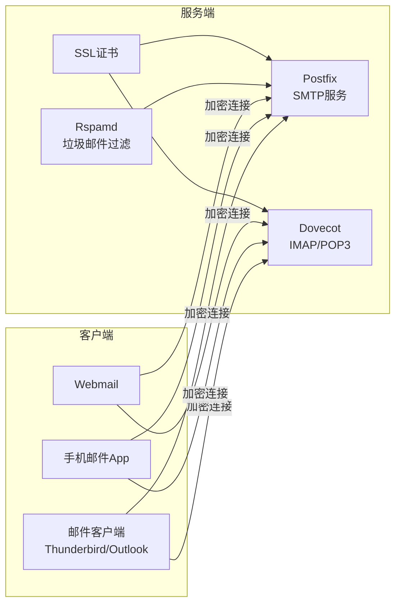

import { Tabs, Callout, Steps, Cards, FileTree } from 'nextra/components'

# 自建邮箱服务器：服务端与客户端配置完整指南

<Callout type="info" emoji="📧">
本教程将同步展示服务端配置和客户端配置，让你能够同时了解两端的设置过程。左侧为服务端操作，右侧为客户端配置。
</Callout>

## 架构概览



## 准备工作

<Tabs items={['服务端准备', '客户端准备']}>
  <Tabs.Tab>
    ### 服务端需求
    
    **硬件要求** 🖥️
    - VPS服务器（公网IP）
    - 最低2GB内存
    - 20GB存储空间
    - Ubuntu 22.04 LTS
    
    **网络要求** 🌐
    - 域名（如example.com）
    - 25端口开放
    - 反向DNS（PTR记录）
    - 固定公网IP
    
    ### 检查端口状态
    ```bash
    # 检查25端口是否开放
    telnet gmail-smtp-in.l.google.com 25
    
    # 如果连接失败，联系VPS提供商开放端口
    ```
  </Tabs.Tab>
  
  <Tabs.Tab>
    ### 客户端选择
    
    **桌面客户端** 💻
    - Thunderbird（推荐）
    - Microsoft Outlook
    - Apple Mail
    - Mailspring
    
    **移动客户端** 📱
    - iOS内置邮件
    - Gmail App（支持IMAP）
    - Outlook Mobile
    - K-9 Mail（Android）
    
    ### 准备信息
    - 邮箱地址（user@yourdomain.com）
    - 密码
    - 服务器地址（mail.yourdomain.com）
  </Tabs.Tab>
</Tabs>

## 第一步：DNS配置

<Callout type="warning" emoji="⚠️">
DNS配置需要时间生效，建议先完成此步骤，通常需要等待15分钟到48小时。
</Callout>

<Tabs items={['服务端DNS设置', '客户端DNS验证']}>
  <Tabs.Tab>
    ### 在DNS提供商处添加记录
    
    假设域名为 `example.com`，服务器IP为 `1.2.3.4`：
    
    ```dns {2,5,8,11} filename="DNS记录配置"
    ; 邮件服务器主机记录
    mail.example.com.    IN    A       1.2.3.4
    
    ; MX记录 - 指定邮件服务器
    example.com.         IN    MX  10  mail.example.com.
    
    ; SPF记录 - 防止邮件伪造
    example.com.         IN    TXT     "v=spf1 mx a ip4:1.2.3.4 -all"
    
    ; DMARC记录 - 邮件验证策略
    _dmarc.example.com.  IN    TXT     "v=DMARC1; p=quarantine; rua=mailto:admin@example.com"
    ```
    
    ### PTR反向解析设置
    
    <Steps>
      ### 联系VPS提供商
      提交工单请求设置PTR记录
      
      ### 提供信息
      - IP地址：1.2.3.4
      - 域名：mail.example.com
      
      ### 验证设置
      ```bash
      # 验证PTR记录
      host 1.2.3.4
      # 应返回：mail.example.com
      ```
    </Steps>
  </Tabs.Tab>
  
  <Tabs.Tab>
    ### 验证DNS配置
    
    使用在线工具或命令行验证DNS记录是否生效：
    
    ```bash {1,4,7,10} filename="DNS验证命令"
    # 检查A记录
    nslookup mail.example.com
    
    # 检查MX记录  
    nslookup -type=mx example.com
    
    # 检查SPF记录
    nslookup -type=txt example.com
    
    # 使用在线工具
    # 访问 https://mxtoolbox.com
    ```
    
    ### 常用DNS检测工具
    
    <Cards>
      <Cards.Card title="MXToolbox" href="https://mxtoolbox.com">
        全面的邮件服务器诊断工具
      </Cards.Card>
      
      <Cards.Card title="Mail-Tester" href="https://www.mail-tester.com">
        测试邮件配置评分
      </Cards.Card>
    </Cards>
  </Tabs.Tab>
</Tabs>

## 第二步：安装邮件服务器组件

<Tabs items={['服务端安装', '客户端准备']}>
  <Tabs.Tab>
    ### 系统更新与基础配置
    
    ```bash {1,4-5,8-9} filename="initial-setup.sh"
    # 更新系统
    sudo apt update && sudo apt upgrade -y
    
    # 设置主机名
    sudo hostnamectl set-hostname mail.example.com
    
    # 编辑hosts文件
    echo "1.2.3.4 mail.example.com mail" >> /etc/hosts
    ```
    
    ### 安装Postfix（SMTP服务器）
    
    ```bash filename="install-postfix.sh"
    # 安装Postfix
    sudo apt install -y postfix postfix-mysql
    
    # 安装时选择：
    # 1. "Internet Site"
    # 2. System mail name: example.com
    ```
    
    ### 安装Dovecot（IMAP/POP3服务器）
    
    ```bash filename="install-dovecot.sh"
    # 安装Dovecot组件
    sudo apt install -y \
      dovecot-core \
      dovecot-imapd \
      dovecot-pop3d \
      dovecot-lmtpd
    ```
    
    ### 安装SSL证书工具
    
    ```bash filename="install-certbot.sh"
    # 安装Let's Encrypt客户端
    sudo apt install -y certbot
    
    # 获取SSL证书
    sudo certbot certonly --standalone \
      -d mail.example.com \
      --agree-tos \
      --email admin@example.com
    ```
  </Tabs.Tab>
  
  <Tabs.Tab>
    ### 下载邮件客户端
    
    <Cards>
      <Cards.Card title="Thunderbird" href="https://www.thunderbird.net">
        ```bash
        # Ubuntu/Debian
        sudo apt install thunderbird
        
        # macOS
        brew install --cask thunderbird
        
        # Windows
        # 从官网下载安装程序
        ```
      </Cards.Card>
      
      <Cards.Card title="配置要求">
        客户端需要支持：
        - IMAP/SMTP协议
        - SSL/TLS加密
        - STARTTLS
        - 普通密码认证
      </Cards.Card>
    </Cards>
    
    ### 收集配置信息
    
    在配置客户端前，确认以下信息：
    
    | 设置项 | 值 |
    |--------|-----|
    | 邮箱地址 | user@example.com |
    | 用户名 | user@example.com |
    | 密码 | 你的密码 |
    | 接收服务器 | mail.example.com |
    | 发送服务器 | mail.example.com |
  </Tabs.Tab>
</Tabs>

## 第三步：配置邮件服务

<Tabs items={['Postfix配置', 'Dovecot配置', '客户端等待']}>
  <Tabs.Tab>
    ### 配置Postfix主文件
    
    编辑 `/etc/postfix/main.cf`：
    
    ```conf {3-4,7-8,11-12,15-17} filename="/etc/postfix/main.cf"
    # 基础配置
    myhostname = mail.example.com
    mydomain = example.com
    myorigin = $mydomain
    mydestination = $myhostname, localhost.$mydomain, localhost, $mydomain
    
    # 网络配置
    inet_interfaces = all
    inet_protocols = ipv4
    
    # 邮箱格式
    home_mailbox = Maildir/
    
    # SMTP认证
    smtpd_sasl_type = dovecot
    smtpd_sasl_path = private/auth
    smtpd_sasl_auth_enable = yes
    
    # TLS加密
    smtpd_use_tls = yes
    smtpd_tls_cert_file = /etc/letsencrypt/live/mail.example.com/fullchain.pem
    smtpd_tls_key_file = /etc/letsencrypt/live/mail.example.com/privkey.pem
    
    # 安全限制
    smtpd_recipient_restrictions = 
        permit_mynetworks,
        permit_sasl_authenticated,
        reject_unauth_destination
        
    # 邮件大小限制（25MB）
    message_size_limit = 26214400
    ```
    
    ### 配置服务端口
    
    编辑 `/etc/postfix/master.cf`：
    
    ```conf {2-8,11-16} filename="/etc/postfix/master.cf"
    # Submission端口（587）- 客户端发送邮件
    submission inet n       -       y       -       -       smtpd
      -o syslog_name=postfix/submission
      -o smtpd_tls_security_level=encrypt
      -o smtpd_sasl_auth_enable=yes
      -o smtpd_tls_auth_only=yes
      -o smtpd_recipient_restrictions=permit_sasl_authenticated,reject
    
    # SMTPS端口（465）- SSL加密
    smtps     inet  n       -       y       -       -       smtpd
      -o syslog_name=postfix/smtps
      -o smtpd_tls_wrappermode=yes
      -o smtpd_sasl_auth_enable=yes
      -o smtpd_recipient_restrictions=permit_sasl_authenticated,reject
    ```
  </Tabs.Tab>
  
  <Tabs.Tab>
    ### 配置认证机制
    
    编辑 `/etc/dovecot/conf.d/10-auth.conf`：
    
    ```conf {2,5,8} filename="10-auth.conf"
    # 禁用明文认证
    disable_plaintext_auth = yes
    
    # 认证机制
    auth_mechanisms = plain login
    
    # 使用系统用户
    !include auth-system.conf.ext
    ```
    
    ### 配置SSL加密
    
    编辑 `/etc/dovecot/conf.d/10-ssl.conf`：
    
    ```conf {2,5-6,9-10} filename="10-ssl.conf"
    # 强制SSL
    ssl = required
    
    # 证书路径
    ssl_cert = </etc/letsencrypt/live/mail.example.com/fullchain.pem
    ssl_key = </etc/letsencrypt/live/mail.example.com/privkey.pem
    
    # 安全协议
    ssl_min_protocol = TLSv1.2
    ssl_prefer_server_ciphers = yes
    ```
    
    ### 配置邮箱存储
    
    编辑 `/etc/dovecot/conf.d/10-mail.conf`：
    
    ```conf {2,5} filename="10-mail.conf"
    # 邮箱位置
    mail_location = maildir:~/Maildir
    
    # 邮箱权限组
    mail_privileged_group = mail
    ```
    
    ### Postfix集成
    
    编辑 `/etc/dovecot/conf.d/10-master.conf`：
    
    ```conf {3-7} filename="10-master.conf"
    service auth {
      # Postfix SMTP认证
      unix_listener /var/spool/postfix/private/auth {
        mode = 0660
        user = postfix
        group = postfix
      }
    }
    ```
  </Tabs.Tab>
  
  <Tabs.Tab>
    ### 服务端配置进行中...
    
    <Callout type="info">
    服务端正在配置Postfix和Dovecot，这是邮件系统的核心组件。配置完成后，你就可以开始设置客户端了。
    </Callout>
    
    ### 配置检查清单
    
    在开始客户端配置前，确保服务端已完成：
    
    - ✅ Postfix安装和配置
    - ✅ Dovecot安装和配置  
    - ✅ SSL证书获取
    - ✅ 防火墙端口开放
    - ✅ 用户账户创建
    
    ### 端口说明
    
    | 端口 | 协议 | 用途 | 加密 |
    |------|------|------|------|
    | 25 | SMTP | 接收邮件 | 可选 |
    | 587 | SMTP | 发送邮件 | STARTTLS |
    | 465 | SMTPS | 发送邮件 | SSL/TLS |
    | 143 | IMAP | 接收邮件 | STARTTLS |
    | 993 | IMAPS | 接收邮件 | SSL/TLS |
    | 110 | POP3 | 接收邮件 | STARTTLS |
    | 995 | POP3S | 接收邮件 | SSL/TLS |
  </Tabs.Tab>
</Tabs>

## 第四步：创建用户和启动服务

<Tabs items={['服务端操作', '客户端配置']}>
  <Tabs.Tab>
    ### 创建邮箱用户
    
    <Tabs items={['系统用户方式', '虚拟用户方式']}>
      <Tabs.Tab>
        ```bash {1,4,7} filename="create-user.sh"
        # 创建系统用户
        sudo adduser mailuser
        
        # 设置密码
        sudo passwd mailuser
        
        # 创建邮箱目录
        sudo -u mailuser mkdir -p /home/mailuser/Maildir
        ```
      </Tabs.Tab>
      
      <Tabs.Tab>
        ```bash {2-5,8} filename="virtual-users.sh"
        # 创建虚拟用户映射
        cat >> /etc/postfix/virtual << EOF
        admin@example.com    mailuser
        info@example.com     mailuser
        EOF
        
        # 更新映射数据库
        sudo postmap /etc/postfix/virtual
        ```
      </Tabs.Tab>
    </Tabs>
    
    ### 配置防火墙
    
    ```bash {2,5-12} filename="firewall.sh"
    # 启用防火墙
    sudo ufw enable
    
    # 开放邮件端口
    sudo ufw allow 22/tcp    # SSH
    sudo ufw allow 25/tcp    # SMTP
    sudo ufw allow 587/tcp   # Submission
    sudo ufw allow 465/tcp   # SMTPS
    sudo ufw allow 143/tcp   # IMAP
    sudo ufw allow 993/tcp   # IMAPS
    sudo ufw allow 80/tcp    # HTTP
    sudo ufw allow 443/tcp   # HTTPS
    ```
    
    ### 启动服务
    
    ```bash {1-2,5-6,9} filename="start-services.sh"
    # 重启Postfix
    sudo systemctl restart postfix
    sudo systemctl enable postfix
    
    # 重启Dovecot
    sudo systemctl restart dovecot
    sudo systemctl enable dovecot
    
    # 检查状态
    sudo systemctl status postfix dovecot
    ```
    
    ### 测试邮件服务
    
    ```bash {1-2,5-6} filename="test-mail.sh"
    # 发送测试邮件
    echo "Test email" | mail -s "Test" user@gmail.com
    
    # 查看邮件日志
    sudo tail -f /var/log/mail.log
    ```
  </Tabs.Tab>
  
  <Tabs.Tab>
    ### Thunderbird配置
    
    <Steps>
      ### 打开账户设置
      文件 → 新建 → 现有邮件账户
      
      ### 输入账户信息
      - 您的姓名：`张三`
      - 邮箱地址：`user@example.com`
      - 密码：`你的密码`
      
      ### 手动配置服务器
      点击"手动配置"按钮
    </Steps>
    
    ### 服务器配置参数
    
    <Tabs items={['接收服务器', '发送服务器']}>
      <Tabs.Tab>
        | 设置 | IMAP | POP3 |
        |------|------|------|
        | 协议 | IMAP | POP3 |
        | 服务器 | mail.example.com | mail.example.com |
        | 端口 | 993 | 995 |
        | SSL | SSL/TLS | SSL/TLS |
        | 认证 | 普通密码 | 普通密码 |
        | 用户名 | user@example.com | user@example.com |
      </Tabs.Tab>
      
      <Tabs.Tab>
        | 设置 | 推荐配置 | 备选配置 |
        |------|----------|----------|
        | 协议 | SMTP | SMTP |
        | 服务器 | mail.example.com | mail.example.com |
        | 端口 | 587 | 465 |
        | SSL | STARTTLS | SSL/TLS |
        | 认证 | 普通密码 | 普通密码 |
        | 用户名 | user@example.com | user@example.com |
      </Tabs.Tab>
    </Tabs>
    
    ### Outlook配置
    
    <Steps>
      ### 添加账户
      文件 → 添加账户 → 手动设置
      
      ### 选择协议
      选择 IMAP 或 POP
      
      ### 输入服务器信息
      按照上表填写服务器参数
      
      ### 测试连接
      点击"测试账户设置"
    </Steps>
    
    ### 手机邮件配置
    
    <Tabs items={['iOS Mail', 'Gmail App']}>
      <Tabs.Tab>
        1. 设置 → 邮件 → 账户 → 添加账户
        2. 选择"其他"
        3. 添加邮件账户
        4. 输入服务器信息（同上表）
      </Tabs.Tab>
      
      <Tabs.Tab>
        1. Gmail → 设置 → 添加账户
        2. 选择"其他(IMAP)"
        3. 输入邮箱地址和密码
        4. 手动输入服务器信息
      </Tabs.Tab>
    </Tabs>
  </Tabs.Tab>
</Tabs>

## 第五步：安全加固和优化

<Tabs items={['服务端安全', '客户端安全']}>
  <Tabs.Tab>
    ### 安装垃圾邮件过滤器
    
    ```bash {1-2,5-7,10-11} filename="install-rspamd.sh"
    # 添加Rspamd仓库
    wget -O- https://rspamd.com/apt-stable/gpg.key | sudo apt-key add -
    echo "deb http://rspamd.com/apt-stable/ $(lsb_release -cs) main" | \
      sudo tee /etc/apt/sources.list.d/rspamd.list
    
    # 安装Rspamd
    sudo apt update
    sudo apt install -y rspamd
    
    # 配置Web界面密码
    sudo rspamadm pw
    ```
    
    ### 配置DKIM签名
    
    ```bash {1-2,5-7,10-11} filename="setup-dkim.sh"
    # 安装OpenDKIM
    sudo apt install -y opendkim opendkim-tools
    
    # 生成密钥
    sudo mkdir -p /etc/opendkim/keys/example.com
    cd /etc/opendkim/keys/example.com
    sudo opendkim-genkey -t -s mail -d example.com
    
    # 设置权限
    sudo chown -R opendkim:opendkim /etc/opendkim
    ```
    
    ### 配置Fail2ban防暴力破解
    
    ```bash {1,4-10} filename="setup-fail2ban.sh"
    # 安装Fail2ban
    sudo apt install -y fail2ban
    
    # 创建邮件服务规则
    cat > /etc/fail2ban/jail.local << EOF
    [postfix-sasl]
    enabled = true
    filter = postfix[mode=auth]
    logpath = /var/log/mail.log
    maxretry = 3
    
    [dovecot]
    enabled = true
    filter = dovecot
    logpath = /var/log/dovecot.log
    maxretry = 3
    EOF
    
    # 重启服务
    sudo systemctl restart fail2ban
    ```
    
    ### 配置自动备份
    
    ```bash filename="backup.sh"
    #!/bin/bash
    # 邮件备份脚本
    BACKUP_DIR="/backup/mail"
    DATE=$(date +%Y%m%d)
    
    # 备份邮箱数据
    tar -czf $BACKUP_DIR/mail-$DATE.tar.gz \
      /home/*/Maildir/ \
      /etc/postfix/ \
      /etc/dovecot/
    
    # 保留30天备份
    find $BACKUP_DIR -mtime +30 -delete
    ```
  </Tabs.Tab>
  
  <Tabs.Tab>
    ### 客户端安全设置
    
    <Callout type="warning" emoji="🔒">
    始终使用加密连接，避免在公共WiFi下使用未加密的邮件协议。
    </Callout>
    
    ### Thunderbird安全配置
    
    <Steps>
      ### 启用主密码
      设置 → 隐私与安全 → 主密码
      
      ### 配置S/MIME或PGP
      账户设置 → 端到端加密
      
      ### 启用垃圾邮件过滤
      账户设置 → 垃圾邮件设置
    </Steps>
    
    ### 密码安全建议
    
    <Cards>
      <Cards.Card title="使用强密码">
        - 至少12位字符
        - 包含大小写字母、数字、特殊字符
        - 避免使用个人信息
      </Cards.Card>
      
      <Cards.Card title="启用两步验证">
        如果邮件服务器支持，启用2FA增加安全性
      </Cards.Card>
      
      <Cards.Card title="定期更换密码">
        建议每3-6个月更换一次密码
      </Cards.Card>
    </Cards>
    
    ### 识别钓鱼邮件
    
    | 可疑特征 | 说明 |
    |----------|------|
    | 发件人地址异常 | 仔细检查发件人域名 |
    | 语法错误 | 官方邮件很少有拼写错误 |
    | 紧急行动要求 | 要求立即点击链接或提供密码 |
    | 可疑附件 | .exe, .scr, .vbs等可执行文件 |
    | 通用称呼 | "亲爱的用户"而非具体姓名 |
  </Tabs.Tab>
</Tabs>

## 故障排查

<Tabs items={['服务端排查', '客户端排查']}>
  <Tabs.Tab>
    ### 常见问题诊断
    
    <Tabs items={['端口问题', '认证失败', '邮件被拒']}>
      <Tabs.Tab>
        ```bash {1,4,7,10} filename="check-ports.sh"
        # 检查端口监听
        sudo netstat -tlnp | grep -E '25|587|993'
        
        # 测试25端口
        telnet gmail-smtp-in.l.google.com 25
        
        # 检查防火墙
        sudo ufw status verbose
        
        # 查看端口占用
        sudo lsof -i :25
        ```
        
        <Callout type="error">
        如果25端口被封锁，联系VPS提供商申请解封，或使用邮件中继服务。
        </Callout>
      </Tabs.Tab>
      
      <Tabs.Tab>
        ```bash {1,4,7} filename="check-auth.sh"
        # 测试Dovecot认证
        sudo doveadm auth test username
        
        # 查看认证日志
        sudo grep "authentication failed" /var/log/mail.log
        
        # 检查SASL配置
        sudo postconf | grep sasl
        ```
        
        常见原因：
        - 密码错误
        - 用户不存在
        - SASL配置错误
        - 权限问题
      </Tabs.Tab>
      
      <Tabs.Tab>
        ```bash {1,4,7} filename="check-rejection.sh"
        # 查看退信日志
        sudo grep "rejected" /var/log/mail.log
        
        # 检查邮件队列
        sudo postqueue -p
        
        # 查看详细错误
        sudo postcat -q QUEUE_ID
        ```
        
        常见原因：
        - SPF/DKIM配置错误
        - IP在黑名单
        - PTR记录未设置
        - 发送频率过高
      </Tabs.Tab>
    </Tabs>
    
    ### 日志文件位置
    
    <FileTree>
      <FileTree.Folder name="/var/log" defaultOpen>
        <FileTree.File name="mail.log" />
        <FileTree.File name="mail.err" />
        <FileTree.File name="dovecot.log" />
        <FileTree.Folder name="rspamd">
          <FileTree.File name="rspamd.log" />
        </FileTree.Folder>
      </FileTree.Folder>
    </FileTree>
    
    ### 性能监控
    
    ```bash filename="monitor.sh"
    # 实时监控邮件日志
    tail -f /var/log/mail.log
    
    # 查看系统资源
    htop
    
    # 邮件队列统计
    sudo qshape deferred
    
    # Postfix统计
    sudo pflogsumm /var/log/mail.log
    ```
  </Tabs.Tab>
  
  <Tabs.Tab>
    ### 连接问题排查
    
    <Steps>
      ### 检查网络连接
      ```bash
      # Windows
      ping mail.example.com
      nslookup mail.example.com
      
      # macOS/Linux  
      ping mail.example.com
      dig mail.example.com
      ```
      
      ### 测试端口连通性
      ```bash
      # 测试IMAP
      telnet mail.example.com 993
      
      # 测试SMTP
      telnet mail.example.com 587
      ```
      
      ### 验证SSL证书
      ```bash
      openssl s_client -connect mail.example.com:993
      openssl s_client -starttls smtp -connect mail.example.com:587
      ```
    </Steps>
    
    ### 常见客户端错误
    
    | 错误信息 | 可能原因 | 解决方案 |
    |----------|----------|----------|
    | 无法连接到服务器 | 网络问题或端口封锁 | 检查防火墙和网络 |
    | 认证失败 | 密码错误或用户名格式 | 确认使用完整邮箱地址 |
    | 证书错误 | 自签名证书或过期 | 添加例外或更新证书 |
    | 发送失败 | SMTP配置错误 | 检查端口和加密设置 |
    | 超时错误 | 服务器响应慢 | 增加超时时间设置 |
    
    ### Thunderbird调试模式
    
    <Steps>
      ### 启用日志
      编辑 → 首选项 → 高级 → 配置编辑器
      
      ### 设置日志级别
      搜索 `mailnews.imap.loglevel`
      设置为 `5`（最详细）
      
      ### 查看错误控制台
      工具 → 开发者工具 → 错误控制台
    </Steps>
  </Tabs.Tab>
</Tabs>

## 高级功能

<Tabs items={['Webmail安装', '邮件列表', '自动回复']}>
  <Tabs.Tab>
    ### 安装Roundcube Webmail
    
    ```bash {1-3,6-8,11-13} filename="install-roundcube.sh"
    # 安装依赖
    sudo apt install -y nginx php-fpm php-mysql \
      php-curl php-zip php-xml php-mbstring mariadb-server
    
    # 下载Roundcube
    cd /var/www
    sudo wget https://github.com/roundcube/roundcubemail/releases/download/1.6.5/roundcubemail-1.6.5-complete.tar.gz
    sudo tar -xzf roundcubemail-1.6.5-complete.tar.gz
    
    # 配置数据库
    sudo mysql -e "CREATE DATABASE roundcube;"
    sudo mysql -e "GRANT ALL ON roundcube.* TO 'roundcube'@'localhost' IDENTIFIED BY 'password';"
    ```
    
    ### Nginx配置
    
    ```nginx filename="/etc/nginx/sites-available/webmail"
    server {
        listen 80;
        server_name webmail.example.com;
        root /var/www/roundcube;
        
        location / {
            index index.php;
            try_files $uri $uri/ /index.php?$query_string;
        }
        
        location ~ \.php$ {
            fastcgi_pass unix:/var/run/php/php-fpm.sock;
            fastcgi_index index.php;
            include fastcgi_params;
        }
    }
    ```
    
    访问 `http://webmail.example.com/installer` 完成安装向导。
  </Tabs.Tab>
  
  <Tabs.Tab>
    ### 配置Mailman邮件列表
    
    ```bash {1,4-6} filename="install-mailman.sh"
    # 安装Mailman3
    sudo apt install -y mailman3-full
    
    # 创建列表
    sudo -u list mailman create mylist@example.com
    sudo -u list mailman addmembers mylist@example.com members.txt
    ```
    
    ### Postfix集成
    
    ```conf filename="/etc/postfix/main.cf"
    # 添加Mailman支持
    relay_domains = lists.example.com
    transport_maps = hash:/etc/postfix/transport
    mailman_destination_recipient_limit = 1
    ```
    
    ### 列表管理命令
    
    ```bash
    # 查看所有列表
    sudo -u list mailman lists
    
    # 添加成员
    echo "user@example.com" | sudo -u list mailman addmembers mylist@example.com
    
    # 删除成员
    sudo -u list mailman delmembers mylist@example.com user@example.com
    ```
  </Tabs.Tab>
  
  <Tabs.Tab>
    ### 使用Sieve配置自动回复
    
    ```bash {1,4-5} filename="setup-sieve.sh"
    # 安装Sieve支持
    sudo apt install -y dovecot-sieve dovecot-managesieved
    
    # 启用Sieve
    echo "protocols = imap sieve" >> /etc/dovecot/dovecot.conf
    ```
    
    ### 创建自动回复规则
    
    ```sieve filename="~/.dovecot.sieve"
    require ["vacation"];
    
    vacation
      :days 1
      :subject "自动回复：我正在休假"
      :addresses ["user@example.com"]
    "您好，
    
    我目前正在休假，将于2024年1月15日返回。
    如有紧急事项，请联系 backup@example.com。
    
    谢谢！";
    ```
    
    ### 编译和激活规则
    
    ```bash
    # 编译Sieve脚本
    sievec ~/.dovecot.sieve
    
    # 重启Dovecot
    sudo systemctl restart dovecot
    ```
  </Tabs.Tab>
</Tabs>

## 维护和监控

<Tabs items={['定期维护', '性能优化', '监控告警']}>
  <Tabs.Tab>
    ### 日常维护任务
    
    <Cards>
      <Cards.Card title="每日任务">
        - 检查邮件队列
        - 查看错误日志
        - 监控磁盘空间
        - 检查服务状态
      </Cards.Card>
      
      <Cards.Card title="每周任务">
        - 分析邮件统计
        - 清理垃圾邮件
        - 更新垃圾邮件规则
        - 检查备份完整性
      </Cards.Card>
      
      <Cards.Card title="每月任务">
        - 系统更新
        - 证书续期检查
        - 性能分析
        - 安全审计
      </Cards.Card>
    </Cards>
    
    ### 维护脚本
    
    ```bash filename="maintenance.sh"
    #!/bin/bash
    
    echo "=== 邮件系统维护报告 ==="
    echo "日期: $(date)"
    
    # 检查服务状态
    echo -e "\n服务状态:"
    systemctl status postfix dovecot rspamd --no-pager
    
    # 邮件队列
    echo -e "\n邮件队列:"
    postqueue -p | tail -5
    
    # 磁盘使用
    echo -e "\n磁盘使用:"
    df -h /home
    
    # 最近错误
    echo -e "\n最近错误:"
    grep -i error /var/log/mail.log | tail -10
    ```
  </Tabs.Tab>
  
  <Tabs.Tab>
    ### Postfix优化
    
    ```conf filename="/etc/postfix/main.cf"
    # 性能调优参数
    default_process_limit = 100
    smtpd_client_connection_count_limit = 50
    smtpd_client_connection_rate_limit = 30
    
    # 队列优化
    maximal_queue_lifetime = 5d
    bounce_queue_lifetime = 5d
    queue_run_delay = 300s
    minimal_backoff_time = 300s
    maximal_backoff_time = 4000s
    ```
    
    ### Dovecot优化
    
    ```conf filename="/etc/dovecot/conf.d/10-master.conf"
    service imap {
      # 增加进程数
      process_limit = 1024
      process_min_avail = 5
      
      # 客户端限制
      client_limit = 10
      service_count = 200
    }
    
    # 登录进程优化
    service imap-login {
      inet_listener imap {
        port = 143
      }
      inet_listener imaps {
        port = 993
        ssl = yes
      }
      
      process_min_avail = 5
      service_count = 1
      client_limit = 1000
    }
    ```
    
    ### 系统优化
    
    ```bash filename="/etc/sysctl.conf"
    # 网络优化
    net.core.somaxconn = 1024
    net.ipv4.tcp_fin_timeout = 30
    net.ipv4.tcp_keepalive_time = 1200
    
    # 文件描述符
    fs.file-max = 65535
    ```
  </Tabs.Tab>
  
  <Tabs.Tab>
    ### 安装监控工具
    
    ```bash {1-2,5-6} filename="install-monitoring.sh"
    # 安装Monit
    sudo apt install -y monit
    
    # 安装Prometheus节点导出器
    sudo apt install -y prometheus-node-exporter
    ```
    
    ### Monit配置
    
    ```conf filename="/etc/monit/conf.d/mail"
    # 监控Postfix
    check process postfix with pidfile /var/spool/postfix/pid/master.pid
      start program = "/bin/systemctl start postfix"
      stop program = "/bin/systemctl stop postfix"
      if failed port 25 protocol smtp then restart
      if 5 restarts within 5 cycles then alert
    
    # 监控Dovecot
    check process dovecot with pidfile /var/run/dovecot/master.pid
      start program = "/bin/systemctl start dovecot"
      stop program = "/bin/systemctl stop dovecot"
      if failed port 993 type tcpssl then restart
      if 5 restarts within 5 cycles then alert
    
    # 磁盘空间告警
    check filesystem mail_data with path /home
      if space usage > 80% then alert
      if space usage > 90% then exec "/usr/local/bin/cleanup-old-mail.sh"
    ```
    
    ### 邮件告警脚本
    
    ```bash filename="alert.sh"
    #!/bin/bash
    
    # 检查邮件队列
    QUEUE_SIZE=$(postqueue -p | tail -n 1 | cut -d' ' -f5)
    if [ "$QUEUE_SIZE" -gt 100 ]; then
        echo "警告：邮件队列过大 ($QUEUE_SIZE)" | \
          mail -s "邮件服务器告警" admin@example.com
    fi
    
    # 检查失败认证
    FAILED_AUTH=$(grep "authentication failed" /var/log/mail.log | \
      wc -l)
    if [ "$FAILED_AUTH" -gt 50 ]; then
        echo "警告：大量认证失败 ($FAILED_AUTH)" | \
          mail -s "安全告警" admin@example.com
    fi
    ```
  </Tabs.Tab>
</Tabs>

## 最佳实践建议

<Cards>
  <Cards.Card title="📧 邮件发送" icon="📧">
    - 逐步建立发送信誉
    - 避免群发营销邮件
    - 保持低退信率
    - 及时处理投诉
  </Cards.Card>
  
  <Cards.Card title="🔒 安全加固" icon="🔒">
    - 定期更新系统
    - 使用强密码策略
    - 启用所有安全特性
    - 定期安全审计
  </Cards.Card>
  
  <Cards.Card title="📊 监控维护" icon="📊">
    - 实时监控服务状态
    - 设置告警通知
    - 定期备份数据
    - 记录维护日志
  </Cards.Card>
  
  <Cards.Card title="⚡ 性能优化" icon="⚡">
    - 优化配置参数
    - 使用缓存机制
    - 合理分配资源
    - 定期清理日志
  </Cards.Card>
</Cards>

## 总结

<Callout type="success" emoji="🎉">
恭喜！你已经成功搭建了一个功能完整的邮件服务器系统，包括：

- ✅ 完整的邮件收发功能
- ✅ SSL/TLS加密传输
- ✅ 垃圾邮件过滤
- ✅ 客户端配置支持
- ✅ 安全防护措施
- ✅ 监控和维护方案
</Callout>

### 后续学习资源

<Cards>
  <Cards.Card title="Postfix官方文档" href="http://www.postfix.org/documentation.html">
    深入了解Postfix配置和高级特性
  </Cards.Card>
  
  <Cards.Card title="Dovecot Wiki" href="https://doc.dovecot.org/">
    Dovecot完整配置指南和最佳实践
  </Cards.Card>
  
  <Cards.Card title="Mail-Tester" href="https://www.mail-tester.com/">
    测试邮件服务器配置评分
  </Cards.Card>
  
  <Cards.Card title="MXToolbox" href="https://mxtoolbox.com/">
    全面的邮件服务器诊断工具
  </Cards.Card>
</Cards>

### 需要帮助？

如果在搭建过程中遇到问题：

1. 查看日志文件：`/var/log/mail.log`
2. 检查服务状态：`systemctl status postfix dovecot`
3. 验证DNS记录：使用MXToolbox检查
4. 测试端口连通：`telnet mail.example.com 25`

记住，运营邮件服务器需要持续的维护和优化。建议定期检查系统状态，及时更新软件，保持良好的发送信誉。祝你的邮件服务器运行顺利！